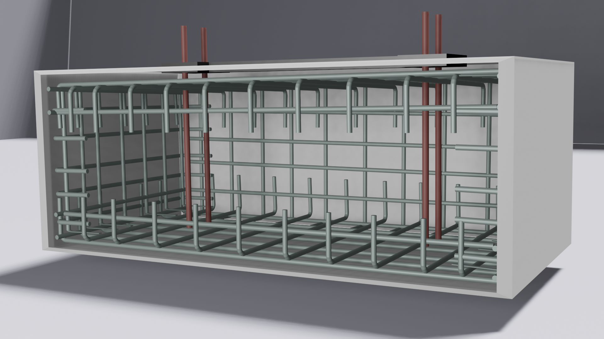
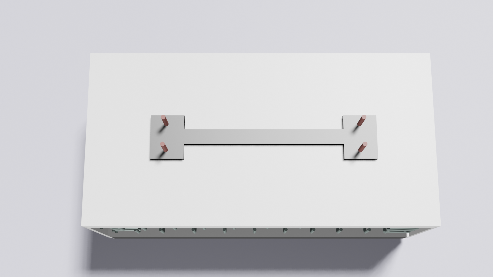
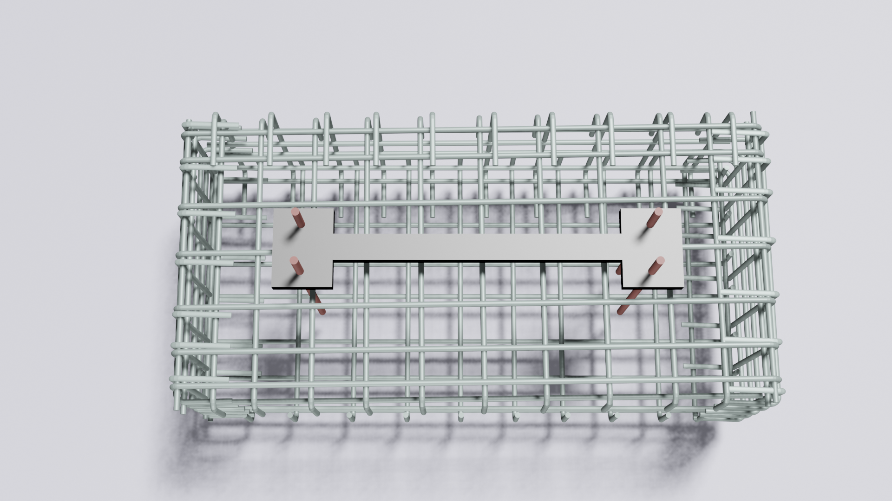
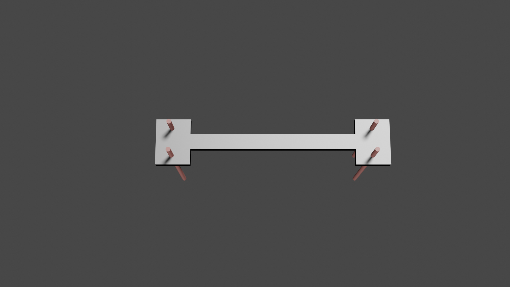

# Concrete Foundation - Blender 3D Model & Web Viewer

A structural engineering simulation of a reinforced concrete foundation for an outdoor pole, modelled in Blender and presented via an interactive 360° web viewer built with A-Frame.

**[Live demo →](https://teduard.github.io/blender-3d-viewer/)**

---

## About the model

The foundation is modelled as a cut-away cross-section, exposing the full internal rebar cage. Blender 3D model available in `concrete_foundation.blend`

---

## Web viewer

The viewer is a single `index.html` file using [A-Frame](https://aframe.io/) to present three 360° equirectangular renders rendered directly from the Blender scene. You can orbit freely with mouse drag or touch, switch between views using the thumbnail panel at the bottom, and enter VR mode on a compatible headset.

No server, no build step. Open `index.html` in a browser or deploy to any static host.

---

## Repository contents

```
index.html                        - A-Frame 360° viewer
1.png / 2.png / 3.png             - equirectangular renders for the viewer
thumb-1.png / thumb-2.png / thumb-3.png - viewer thumbnails
blender/
  concrete_foundation.blend       - Blender source file
  concrete_foundation_*.png       - Cycles renders
  webviewer.jpg                   - VR mode screenshot
```

---

## Running locally

No dependencies to install. Open `index.html` directly in a browser, or serve the folder with any static server:

```bash
npx serve .
```

---

## Renders

 

 
